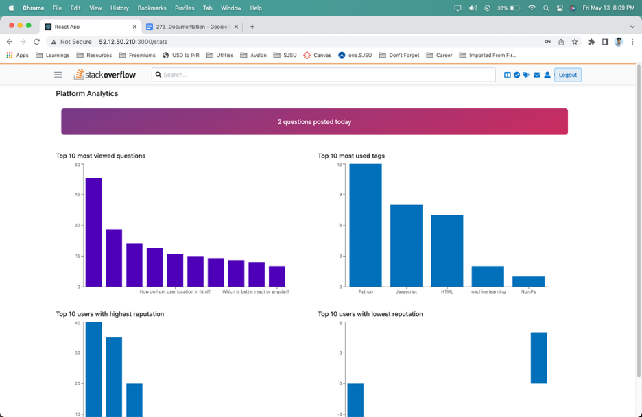

# Stack Overflow Clone

 Stack Overflow clone is a website designed to mimic the functionality and user experience of Stack Overflow, the popular question and answer platform for software developers. It typically allows users to ask and answer technical questions, vote on the best answers, and earn reputation points for their contributions. Which is deployed in the AWS Elastic Compute Cloud (EC2) environment and is equipped with an autoscaling load balancer to manage high traffic demands 

## Tech Stack

 
            

## System Architecture

The application is a 3-tier architecture with the technology stack used below.

### Frontend

- React JS
- Redux

### Middleware

- Kafka
- Passport JWT
- Redis

### Backend

- Node JS
- Express JS

### Database

- MySQL
- MongoDB

### Deployment

- AWS

## Object Management Policy

When a request is made from the client, the request is processed by the API gateway, and the request, along with its parameters like path params, query params and body params are extracted and forwarded to Kafka with a request identifier. Kafka backend which is subscribed to the topic consumes the messages and in turn calls the required controller logics to processes all the business logics. Once the request task is accomplished, the response is put back to the queue for the client to consume. 

The addition of Kafka in the middleware gives better throughput when scaled horizontally though it might drag the performance for less amount of users. From our load and performance testing sessions with various combinations in the instances, we observed it’s throughput when more number of concurrent users were directed to the server. We realized Kafka would be a great fit for microservices, distributed and event driven applications since it can scale at ease.

## Handling heavyweight resources
*	The server's load was distributed and handled via load balancing to multiple instances of our application.
*	To reduce the strain on the database, Redis caching was employed for the most frequently used APIs, resulting in improved speed and retrieval.
*	For system speed and scalability over the data layer, connection pooling was used.
*	Using Kafka, I was able to build a fault-tolerant and scalable system. As the number of concurrent users grew, each thread was handled in a reliable     manner.
*	I utilized Kafka as a messaging queue to handle numerous requests in the backend to manage big-weight resources. I also used Connection pooling to       speed up the fetch response.

## Screenshots of the App

#### Database Schema

#### Sign Up

#### Login Up

#### Home Page

#### Answers

#### Tags Overview

#### Users Overview

#### Admin Analytics

#### Add Tag

#### Messages

#### User Profile Overview 

#### Badges

#### Reputation

#### Search Features

#### Questions Based on Score

#### Questions Based on Interesting Filter

